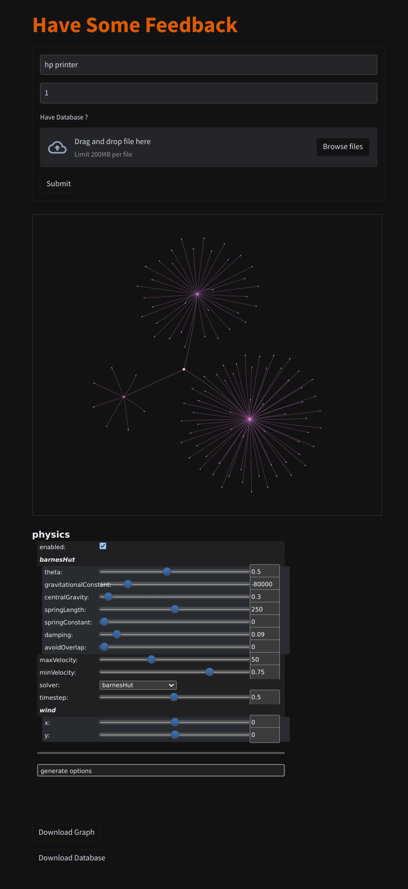

# SpoonFeed

check https://spoonfeed--riturajbasak.repl.co/


> To run

```sh
git clone https://codeberg.org/zz/SpoonFeed
cd SpoonFeed
pip install -r /path/to/requirements.txt
streamlit run main.py --server.headless true
```


